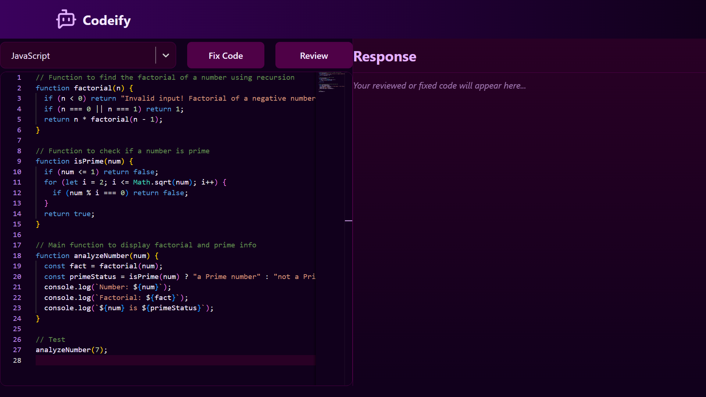
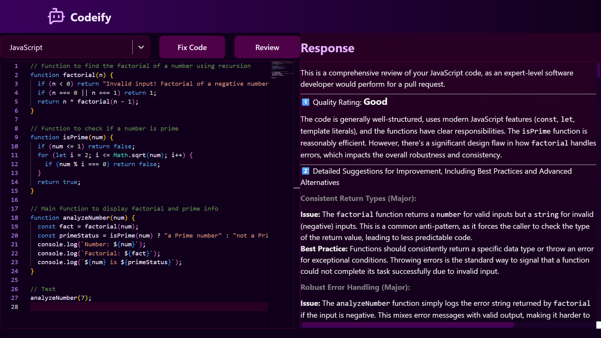
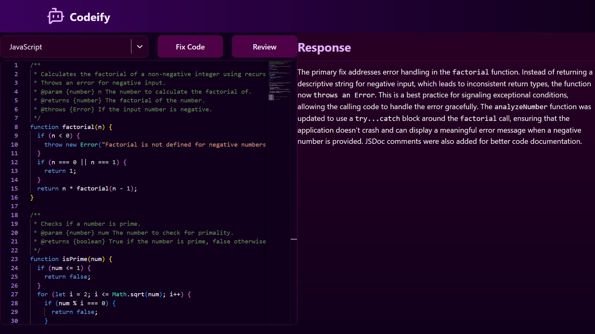

# Codeify

Codeify is an interactive AI-powered code assistant built with **React** and **Vite**.  
It features an integrated Monaco editor and allows developers to **review** or **auto-fix code** using a generative AI backend.

This project demonstrates frontend polish, editor integration, and LLM-powered workflows.

---

## Live demo

🚀 [Click here to visit Codeify](https://codeify-ai.vercel.app/)

---

## Screenshots

### Editor Interface



### AI Review Example


### Fix Code Example


---

## Features

- Monaco editor with language-aware editing
- Language selector and example templates
- "Review" and "Fix Code" AI flows (requires a GenAI API key)
- Syntax highlighted responses and formatted code blocks
- Responsive and minimal UI design
- Built as a modern single-page React app

---

## Tech stack

- React (JSX)
- Vite
- @monaco-editor/react
- react-select
- react-markdown
- lucide-react (icons)
- react-spinners (loader)
- @google/genai or your chosen AI client

---

## Getting started (local development)

Prerequisites

- Node.js 18+ (LTS recommended)
- npm (or yarn)

1. Clone the repo:

```powershell
git clone https://github.com/mearslanahmed/codeify-ai.git
cd codeify
```

2. Install dependencies:

```powershell
npm install
```

3. Create a local env file for any API keys (do NOT commit this file):

Create `.env.local` in the project root with contents like:

```
VITE_GENAI_KEY=your_genai_api_key_here
```

4. Run the dev server:

```powershell
npm run dev
```

Open the URL Vite prints (usually http://localhost:5173).

Note: After adding or changing `.env.local` you must restart the dev server so Vite picks up the new variables.

---

## Build and preview

```powershell
npm run build
npm run preview
```

The `dist/` folder contains the production build.

---

## Environment variables

- `VITE_GENAI_KEY` — API key for the GenAI provider (used by AI "Review" and "Fix Code" features).

---

## Contributing

If you want to extend the project, open an issue or PR. Ideas:

- Improve AI prompts and parsing

---

## License

MIT License - feel free to use or modify this project.

---

## Contact

Software Engineer: **Arslan Ahmed**

- LinkedIn: [Arsalan Ahmed](https://www.linkedin.com/in/mearslanahmed/)
- Email: arslanahmednaseem@gmail.com


---
